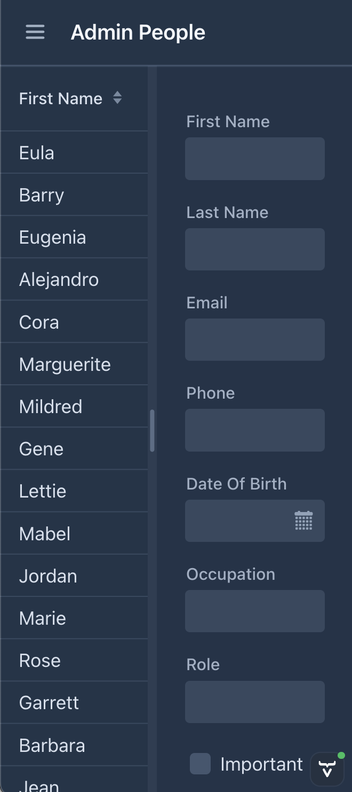
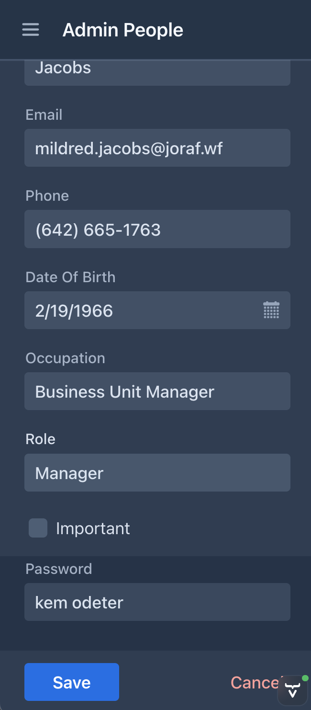

# Hackathon 24.0.0

This is an hybrid project (with views in Flow and Hilla) generated in star.vaadin.com for vaadin 23.3.6 and hilla 1.3.6. 

### Achievements

0. Since I modified the default Person entity by adding a password field, I could discover an [issue](https://github.com/vaadin/start/issues/2325) for the start project
1. Application Migrated from [23.3 to 24.0](https://github.com/vaadin/hackathon-24-0/commit/eece96da4154681c4003ab086acd85c68a846dc2) by following [upgrade guide](https://vaadin.com/docs/next/upgrading). No issues found.
2. Make master-detail java view [responsive](https://github.com/vaadin/hackathon-24-0/commit/1522497fc986b843f89385cadb2f5bbb89dc2ce9). It tries to fix [issue](https://github.com/vaadin/start/issues/856). Here the screenshots:

3. Add [MPR dependencies](https://github.com/vaadin/hackathon-24-0/commit/6b891591cd024517945fd428a4cfb24068283ebe), my idea was put v24-flow-spreadsheet and v8-addon-spreadsheet side by side in order to compare visually and performance of both implementations. I found two blocker issues:
  - they use different version of the POI library, making impossible to run both in the same app, I opened this [ticket](https://github.com/vaadin/spreadsheet/issues/841)
  - legacy license checker fails because some issue in vaadin license server, I [reported](https://github.com/vaadin/platform/issues/3843) it.

4. Then I decided replace v24-flow-spreadsheet in the view by v8 one, I [succeeded](https://github.com/vaadin/hackathon-24-0/commit/0e6de5725e2d2ee2829910bb2bcd5b2c2cc36147), but styles are broken although all dom elements, hence, it needs more work, probably css compilation does not find spreadsheet stuff. Found this issue:
 - `VaadinWebSecurity` stop serving `/framework` requests, fixed in code, but probably it needs futher investigation and reporting

