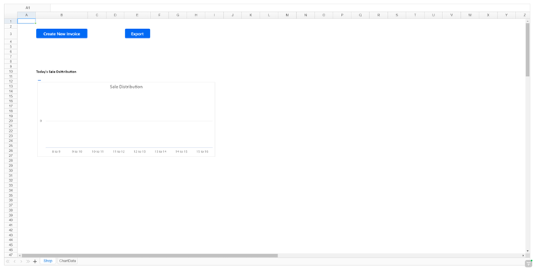
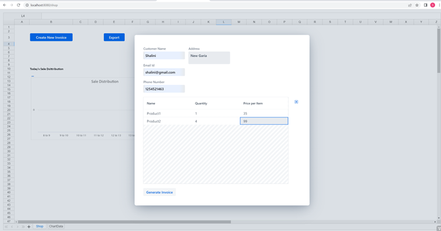
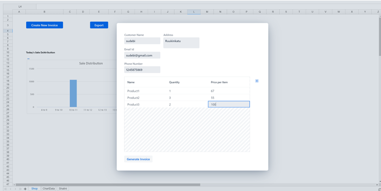
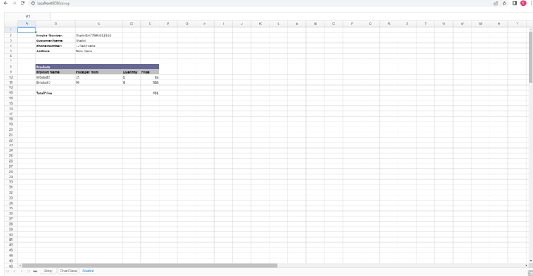
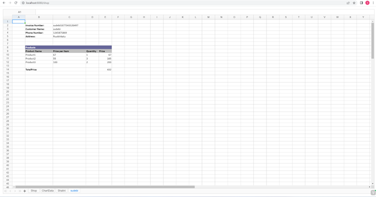
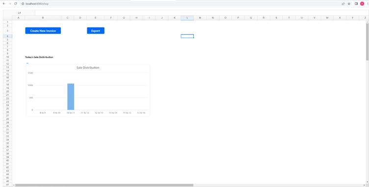
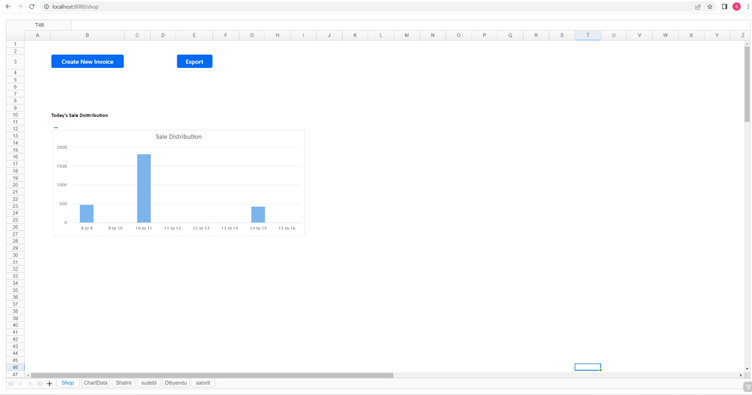

# hackathon-24-0
This project is a simple application where a shop owner creates invoice and on creation of every invoice, an embedded sales distribution chart changes depending on the total sale amount in that hour. 
The application loads a spreadsheet with a chart in it. Initial values for the chart are 0. 
The spreadsheet has two Button components added to it, one to create a new invoice and the other to export the spreadsheet with all the data. The create invoice button opens a dialog on click, where there are input text fields and also a GridPro editor to add the products purchased. On generating the invoice the total amount gets added as a chart data. 

## Running the application
The project is a standard Maven project.Run the application and open http://localhost:8080/shop in browser.

## Application Demo
##### show sales distribution chart and create new invoice/export chart.
The application when loaded for the first time does not show any data in the chart as the values for all the labels are 0 initially.  

##### create new invoice
On creating a new invoice a dialog opens where there are text fields for name, email, phone number and address and it has a GridPro component to add the products. 
Products can be added by clicking on the + sign to the right of the grid.

##### check invoices
On generating invoice a new tab is  created which shows the invoice of the customer and the total amount is added to the hourly sale data in the ChartData Sheet of that particular hour. 

##### check sales distribution chart whenever a new invoice is created.

##### export to excel
click on the export button in shop sheet to download the spreadsheet with all the data. 

## links
- V24 [Migration Guide](https://vaadin.com/docs/next/components/charts/migrating-from-earlier-versions#migration-guide)
- V24 [Supported Technologies](https://github.com/vaadin/platform/issues/3720)
- Hackathon Results [Repository](https://github.com/vaadin/hackathon-24-0
- V24 [Releases Notes](https://github.com/vaadin/platform/blob/24.0/scripts/generator/templates/template-release-notes.md
- Training [slides](https://docs.google.com/presentation/d/1RZJazJbWNU4eab64QnjPBXwcoK_pLBT7vL6qd-WGJvA/edit?userstoinvite=tamas@vaadin.com#slide=id.g1a09ce2961a_0_1)
## Rules
- Use Platform [24.0.0.beta4](https://github.com/vaadin/platform/releases/tag/24.0.0.beta4), Hilla [2.0.0.beta4](https://github.com/vaadin/hilla/releases/tag/2.0.0.beta4)
- Work on an app, a fix, a migration, experiment new features, improve docs, update addon, open issues, etc.
- Push a branch to the REPO (Before Monday 27th at noon)
- If there is no code add a README or screenshots
- Everyone will get a present.
- 3 winners (amazon gift card) (Announced during Release event on Wednesday 1st)
